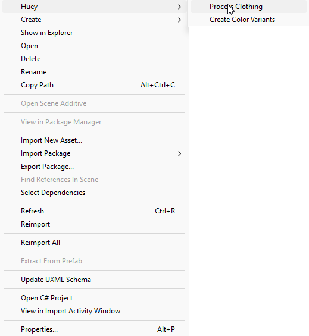

# Huey (v2)

A utility script to produce color variations of clothing within Unity for Unturned.

## 1. Table of Contents

- [Huey (v2)](#huey-v2)
  - [1. Table of Contents](#1-table-of-contents)
  - [2. How to install](#2-how-to-install)
    - [2.1. Unity Package File](#21-unity-package-file)
    - [2.2. Manually Moving Huey Scripts](#22-manually-moving-huey-scripts)
  - [3. How to use](#3-how-to-use)
    - [3.1. Using textures](#31-using-textures)
    - [3.2. Different colors](#32-different-colors)
    - [3.3. Overlay](#33-overlay)

## 2. How to install

Using this has become a lot more simple than the old v1 version.

### 2.1. Unity Package File

Easiest is to import the unity package file and then you are done.

### 2.2. Manually Moving Huey Scripts

You can move the Huey folder in this repository into the root of your project, and then everything should work swell.

## 3. How to use

Using it has become a lot simpler, simply right click anywhere in your unity editor, and if everything has been installed correctly you will be able to see an option for `Huey`, and then select `Process Clothing`.

### 3.1. Using textures

You can add any (preferably white) texture and the script will automatically create color variations.

### 3.2. Different colors

You can always add or remove colors, the colors are modified using the Hue, Saturation and Brightness modifiers set in the ColorSettings file.

### 3.3. Overlay

If you want a part of an image not to be changed from color you can make an Overlay.png, an Overlay.png will be overlayed on any PNG file within the directory. This will allow you to easily add shoes, such as the example for the shorts.
